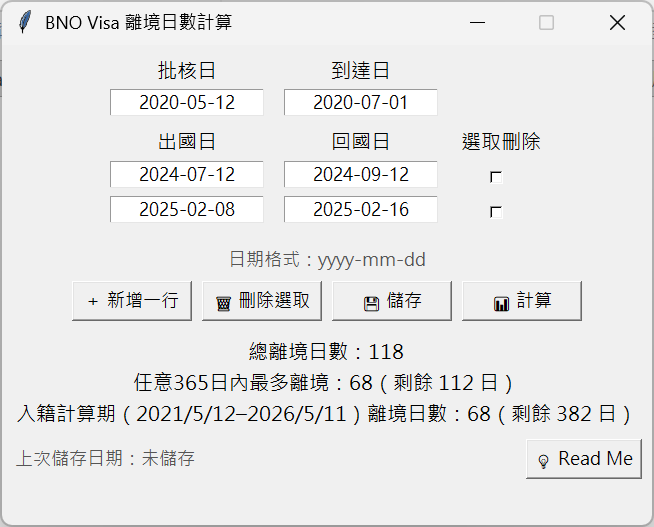

# BNO Visa 離境日數計算機

- 用途：計算由 BNO Visa 批核日起到入籍日的離境日數，以免超出限額

# 計算原則
- 如申請人在香港申請，離境日數由 Visa 批核後即開始計算，直接入境英國為止
- 包括第一次抵達英國當日、之後離開英國當日及返回英國當天，如未超過 00:00 仍會計算留在英國 (i.e.首尾日不計算)
- 離境日數為批核後任何365內不能離開英國180日；入籍則為批核後第二年起至第六年不能離開超過450
- 入籍前365日不能離境超過90日

# 使用方法
- 第一次開啟時先輸入你的批核日子及到達英國日子，程式會算動扣除到達當天日數 (如入境時已過 00:00 請自行加一日)
- 之後可自行增加出、入境日子，程式會算動扣除首尾兩天日數 (如出/入境時已過 00:00 請自行加一日)。可自行加/減離境時段
- 按「計算」即會得出結果
- 按儲存會記錄結果 (會生成 .csv)

# 免責
- 本程式僅供一般計算與參考用途。並已盡力確保輸入、運算與輸出結果的正確性，但不保證結果的準確性、完整性或適用性。
- 使用者在使用本程式時，應自行判斷並驗證計算結果是否符合實際需求。
- 本人不對因使用或依賴本程式所產生的任何直接或間接損失、損害或責任承擔任何責任。
- 使用本程式即表示您已閱讀並同意此免責聲明。
- 如需進行關鍵性或專業用途，請務必諮詢相關專業人士及參考英國政府相關文件。

# 已知 Bug
- 在某些解像度下無法完整顯示界面，須人手放大。
