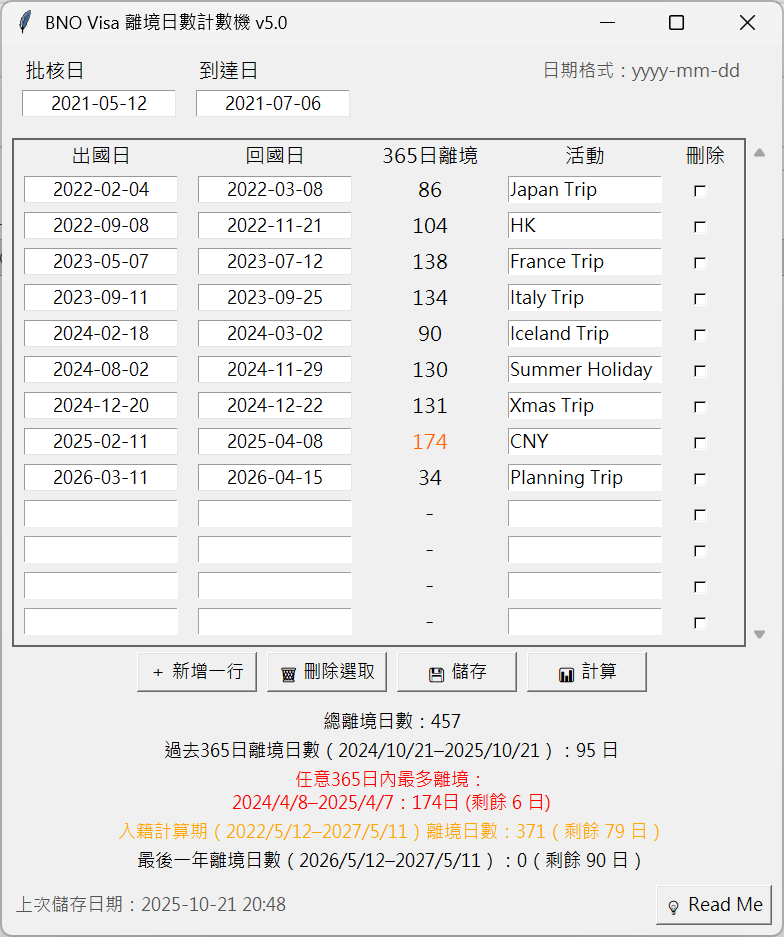

# 更新
- v1.0 基本日子計算
- v2.0 加入任意365日出境計算
- v3.0 分開顯示「過去365日」及「最長任意365日」出境記綠顯示，加入活動備註欄
- v3.0.1 少少修正
- v4.0 新增顯示每個回國日對上365日離境日數、修正界面顯示問題、新增儲存提醒功能及「年、月」之間自動輸入"-"
- v5.0 「365出境」計算結果改由批核日計算

# BNO Visa 離境日數計算機
- 想信近來會開始有 BNO Visa 移英港人陸續可以申請及入籍英國，呢個計數機用黎計算自己出國日子有無超出 Quota
- 亦可計劃未來出境日子以免超過日數
- Local 儲存記錄，不會上載/儲存記錄
  
 

# 計算原則
- 如申請人在香港申請，離境日數由 Visa 批核後即開始計算，直至入境英國為止
- 包括第一次抵達英國、之後離開英國及返回英國當日，如未超過 00:00 仍會計算留在英國 (i.e.首尾日不計算)
- 離境日數為批核後任何365內不能離開英國180日；入籍則為批核後第二年起至第六年不能離開超過450
- 入籍前365日不能離境超過90日

# 使用方法
- 第一次開啟時先輸入你的批核日子及到達英國日子，程式會算動扣除到達當天日數 (如入境時已過 00:00 請自行加一日)
- 之後可自行增加出、入境日子，程式會算動扣除首尾兩天日數 (如出/入境時已過 00:00 請自行加一日)。可自行加/減離境時段
- 按「計算」即會得出結果
- 按儲存會記錄結果 (會生成 .csv)

# 免責
- 本程式僅供一般計算與參考用途。並已盡力確保輸入、運算與輸出結果的正確性，但不保證結果的準確性、完整性或適用性。
- 使用者在使用本程式時，應自行判斷並驗證計算結果是否符合實際需求。
- 本人不對因使用或依賴本程式所產生的任何直接或間接損失、損害或責任承擔任何責任。
- 使用本程式即表示您已閱讀並同意此免責聲明。
- 如需進行關鍵性或專業用途，請務必諮詢相關專業人士及參考英國政府相關文件。
